# Meal Mate

🌐 **[https://mealmateapp.vercel.app](https://mealmateapp.vercel.app)** で公開中

一人暮らしの方向けに，毎日の献立を考える手間を減らすWebアプリ。冷蔵庫にある材料を登録すると，その材料で作れる料理を一致率順に提案し，不足している材料も確認できる。買い物リストや材料・料理のカテゴリ別一覧など，日々の自炊を続けやすくする機能をまとめている。

## 主要機能

- **作れる料理の提案**: 冷蔵庫に登録した材料をもとに，作れる料理を一致率順に提案し，不足材料を表示する
- **冷蔵庫管理**: 保有している食材を登録し，個数や追加日（賞味期限の目安）を管理する
- **買い物リスト**: 不足している材料を買い物リストに追加し，まとめて管理する
- **材料・料理の検索/一覧**: カテゴリごとに色分けされた一覧から，材料・料理を検索できる
- **ユーザー認証・アカウント管理**: サインアップ/ログイン/ログアウトに加え，ユーザー情報の編集，アカウント削除（紐づくデータの一括削除）に対応

## 主な画面

- ホーム

<table>
<tr>
<th>PC</th>
<th>スマホ</th>
</tr>
<tr>
<td>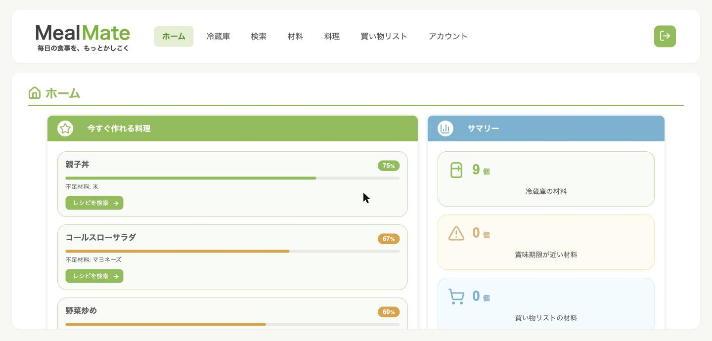</td>
<td>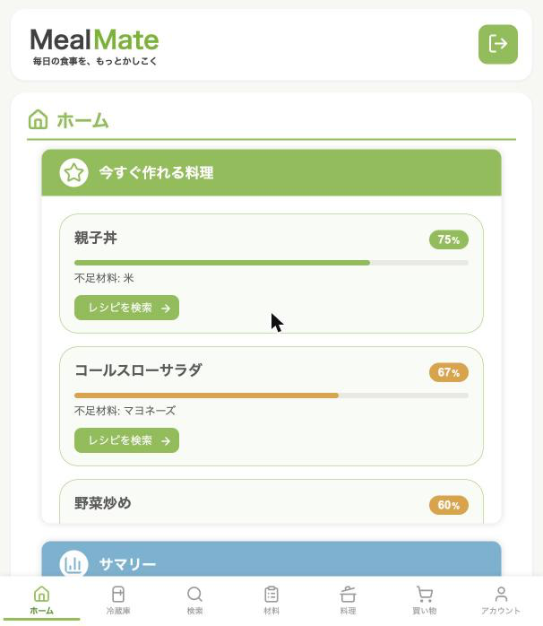</td>
</tr>
</table>

- 材料一覧

<table>
<tr>
<th>PC</th>
<th>スマホ</th>
</tr>
<tr>
<td>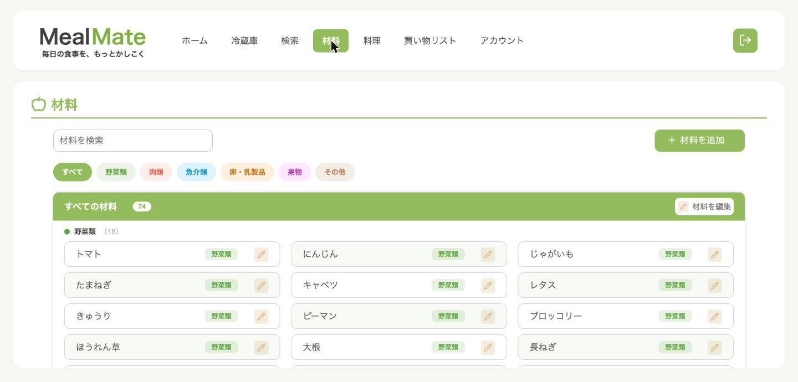</td>
<td>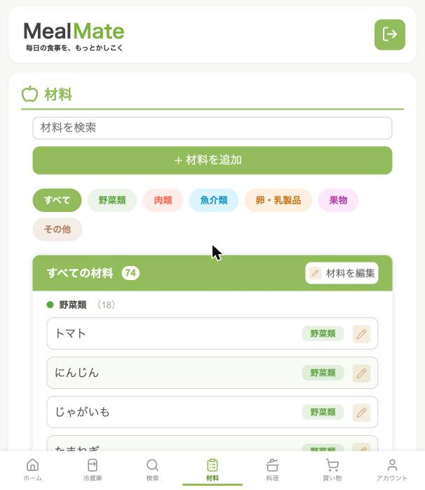</td>
</tr>
</table>

- 料理一覧

<table>
<tr>
<th>PC</th>
<th>スマホ</th>
</tr>
<tr>
<td>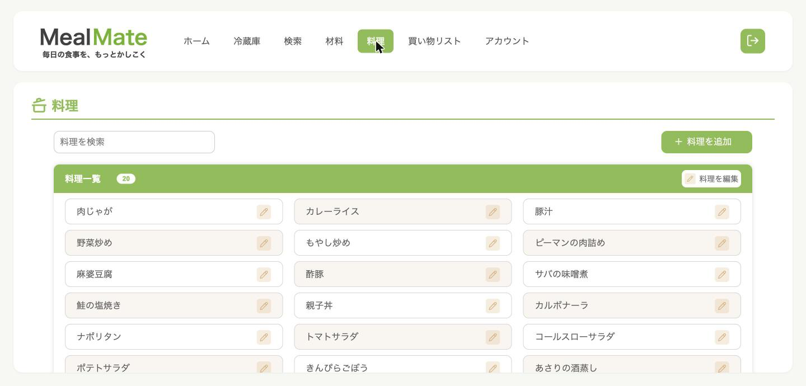</td>
<td>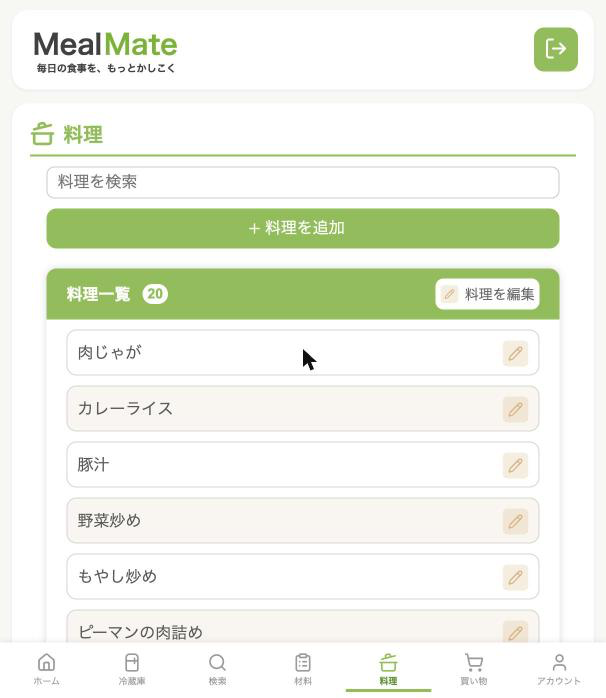</td>
</tr>
</table>

- 検索

<table>
<tr>
<th>PC</th>
<th>スマホ</th>
</tr>
<tr>
<td>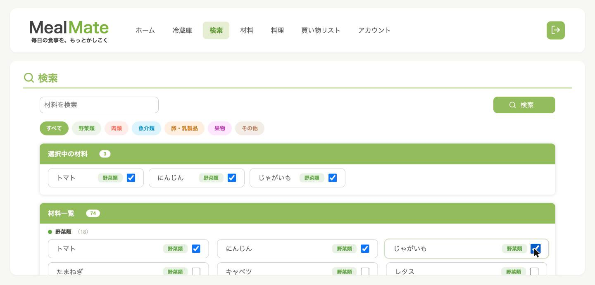</td>
<td>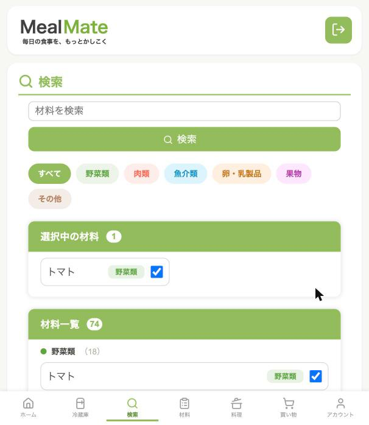</td>
</tr>
</table>

- 冷蔵庫

<table>
<tr>
<th>PC</th>
<th>スマホ</th>
</tr>
<tr>
<td>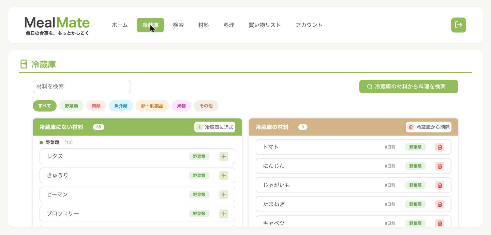</td>
<td>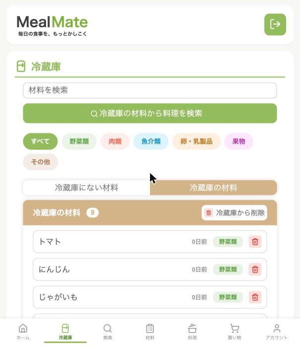</td>
</tr>
</table>

- 買い物リスト

<table>
<tr>
<th>PC</th>
<th>スマホ</th>
</tr>
<tr>
<td>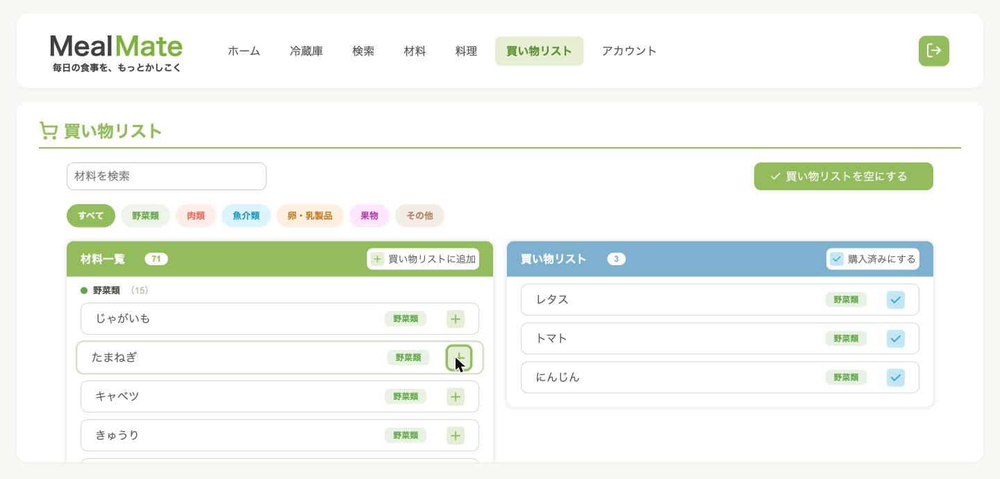</td>
<td>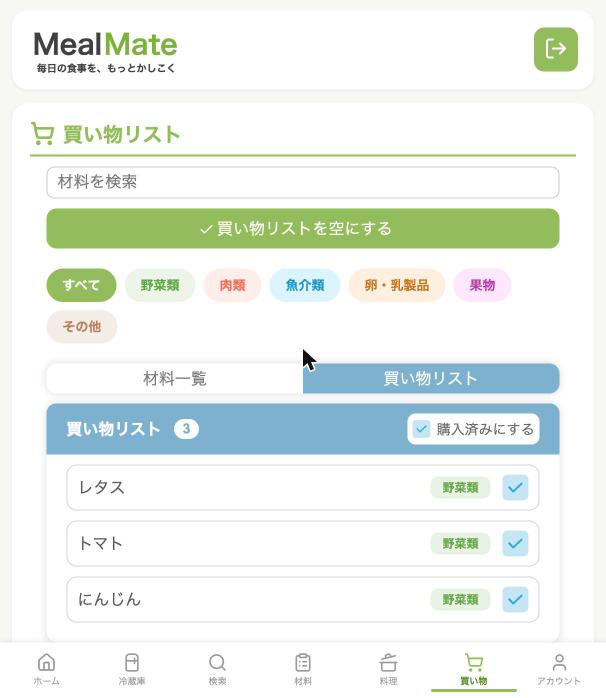</td>
</tr>
</table>

## 技術スタック

| レイヤー | 技術 |
|---|---|
| フロントエンド | React + TypeScript + Vite |
| バックエンド | Python + Flask + SQLAlchemy + Flask-Login + Flask-Migrate + Flask-Cors |
| DB | PostgreSQL（Neon，Vercel Marketplace経由で自動プロビジョニング） |
| ホスティング | Vercel（Vercel Servicesでフロントエンド・バックエンドを1プロジェクトに統合） |

- フロントエンド: `frontend/`（Viteを自動検出）
- バックエンドAPI: `backend/`（Flaskアプリを`main:app`としてサービス化，`/api/*` にルーティング）

## セットアップ

### 前提条件

- Node.js
- Python 3.x
- PostgreSQL（ローカルDB，またはNeonなどのクラウドDBのURL）

### 手順

1. フロントエンドの依存パッケージをインストール

   ```bash
   cd frontend
   npm install
   ```

2. バックエンドの依存パッケージをインストール（仮想環境推奨）

   ```bash
   cd backend
   python -m venv .venv
   source .venv/bin/activate
   pip install -r requirements.txt
   ```

3. バックエンドの環境変数を設定

   `backend/.env` を作成し，以下を設定する。

   ```
   SECRET_KEY=<任意のランダム文字列>
   DATABASE_URL=postgresql+psycopg2://<user>:<password>@<host>/<dbname>
   FRONTEND_ORIGINS=http://127.0.0.1:5173
   ```

4. DBマイグレーションを適用

   ```bash
   flask db upgrade
   ```

5. （任意）初期データを投入

   ```bash
   python seed_ingredients.py
   python seed_dishes.py
   ```

6. バックエンドを起動（`backend/` にて，デフォルトで5000番ポート）

   ```bash
   flask run
   ```

7. フロントエンドの開発サーバーを起動（別ターミナルで `frontend/` にて）

   ```bash
   npm run dev
   ```

   [http://127.0.0.1:5173](http://127.0.0.1:5173) を開く。`/api` へのリクエストはVite proxy経由でバックエンド（5000番ポート）に転送される。

## 主なコマンド

### フロントエンド（`frontend/`）

| コマンド | 内容 |
|---|---|
| `npm run dev` | 開発サーバーを起動 |
| `npm run build` | 本番ビルド（`tsc -b` + `vite build`） |
| `npm run lint` | ESLintを実行 |
| `npm run preview` | ビルド済み成果物をプレビュー |

### バックエンド（`backend/`）

| コマンド | 内容 |
|---|---|
| `flask run` | 開発用サーバーを起動 |
| `flask db migrate -m "message"` | モデルの変更からマイグレーションファイルを生成 |
| `flask db upgrade` | マイグレーションを適用 |
| `python seed_ingredients.py` | 材料の初期データを投入 |
| `python seed_dishes.py` | 料理の初期データを投入 |
| `python unseed_ingredients.py` | 投入した材料データを削除 |

## ディレクトリ構成（抜粋）

```
frontend/
└── src/
    ├── pages/        # 画面ごとのコンポーネント
    ├── components/   # 共通UIコンポーネント
    ├── api/          # バックエンドAPI呼び出し
    ├── context/      # 通知などのReact Context
    ├── types/        # 型定義
    └── utils/        # 共通ロジック（エラーハンドリング，カテゴリ色分けなど）

backend/
├── main.py               # Flaskアプリ本体（ルーティング・モデル定義）
├── migrations/           # Flask-Migrateによるマイグレーション
├── seed_ingredients.py   # 材料の初期データ投入スクリプト
├── seed_dishes.py        # 料理の初期データ投入スクリプト
└── unseed_ingredients.py # 投入した材料データの削除スクリプト
```

## 今後追加予定の機能

- 料理画像表示
- AIによる献立提案
